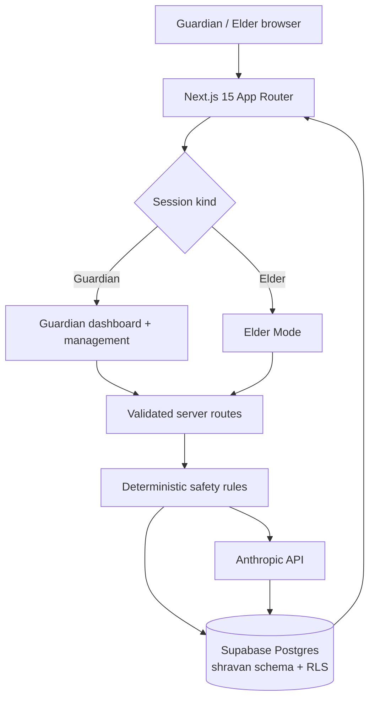

# Shravan architecture flow

The browser renders two experiences from one Next.js application. Guardians authenticate
with Supabase OTP when public keys are present; otherwise a signed demo session exposes
the seeded story. Elders enter through expiring invite links and receive a signed,
30-day device session.

Every mutation passes through server routes. The server resolves the current Guardian or
Elder, validates input, and runs SQL in the isolated `shravan` schema. User-scoped
queries switch to PostgreSQL's `authenticated` role with a request claim, so committed
RLS policies remain the final ownership boundary.

Deterministic distress and scam rules run before Claude. Claude adds conversational
quality and structured extraction, but it cannot lower the deterministic risk or suppress
an urgent alert. Render cron routes use a Bearer secret and fixed IST date logic.

## Gates at a glance

| Gate | Enforcer | Threshold / rule |
|---|---|---|
| Elder invite | Server function | unexpired token and active Elder |
| Check-in turn cap | Server function | 25 user turns |
| Distress | Deterministic function | any configured self-harm/chest-pain/fall phrase |
| Scam minimum | Deterministic function | known pattern forces SUSPICIOUS; urgent money/police/OTP combination forces HIGH |
| Daily cost | Server function | `DAILY_TOKEN_BUDGET`, default 12,000 output+input tokens per Elder |
| Cron auth | Route handler | exact `Authorization: Bearer CRON_SECRET` |
| Ownership | Postgres RLS | Guardian ID or linked Elder profile ID equals auth claim |

## Failure that matters most

If Claude is unavailable during distress, Shravan still writes the URGENT alert and
returns the fixed immediate-help script. If the database is also unavailable, the Elder
still sees the help script, but the Guardian alert cannot be persisted; the route returns
a visible degraded-state warning rather than pretending the alert succeeded.

